# 飞书英文口语锻炼

## 背景
由于openAI自动生成文本，想用它来提升英语口语能力。于是自己写了基于web的对话，但是这样要坐着输入输出，时间长就腰酸背痛。

想着能不能通过手机躺着练习口语，于是调研了微信、钉钉开发者文档，发现微信不支持；钉钉需要在小程序开发录音功能，比较麻烦。

后面发现飞书支持**获取录音、录音下载**开发者功能，于是才有了这个项目。

## 场景
首先介绍一下飞书的录音功能有三个模式：
- 录音功能，也就是录取用户说话的内容
- 语音识别功能，支持英文和普通话输入解析成文字。
- 语音+文字输入模式（文字用于标记语音，跟录音功能没有区别）**用这种模式可以不使用腾讯的ASR**

基于以上三种模式，我设想了以下几种场景：
1. 直接录音，获取飞书录音文件下载，让第三方厂商识别（微软、腾讯等）成文字，然后与openAI进行交互，获得结果，再以第三方厂商生成英文音频文件，最后飞书发回音频给我。 
2. 飞书直接将录音识别成文字，AI交互，生成音频，发送回来
3. 口语评分，对口语的录音进行评分
4. 口语的语法批改
5. 生成托福听力内容（包括学术场景、学校场景等）

## 演示
https://www.bilibili.com/video/BV1fV4y1d7Wv

## 功能


### 话题模式

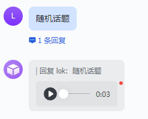

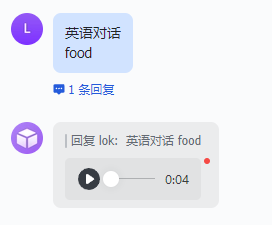


### 余额查询

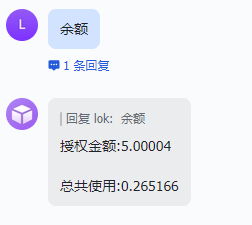

### 帮助列表

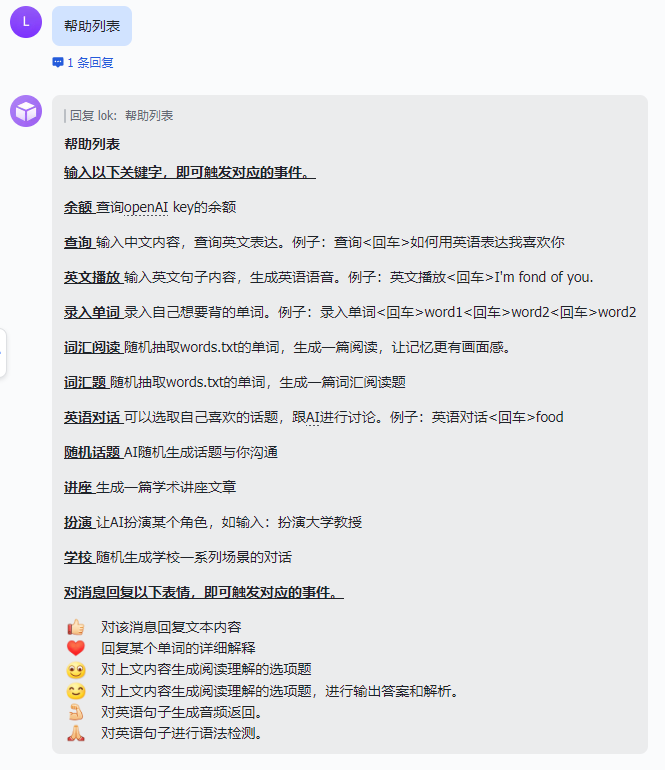

### 查询模式

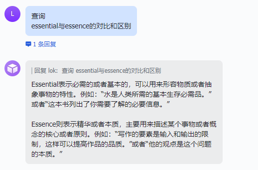

### 官方语音识别

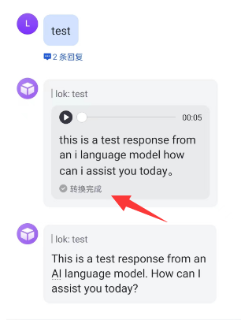


### 录入单词

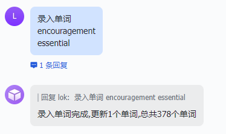

### 词汇阅读

> 要**先录入单词**

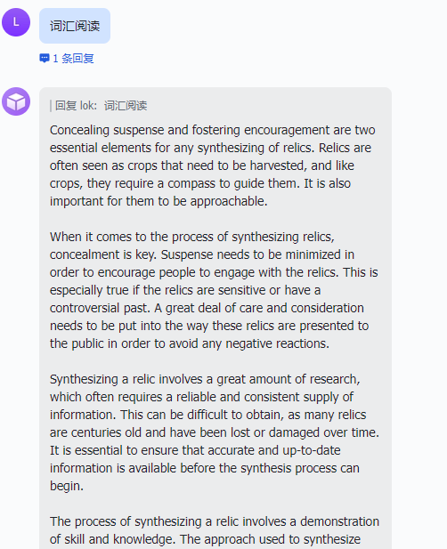


### 角色扮演

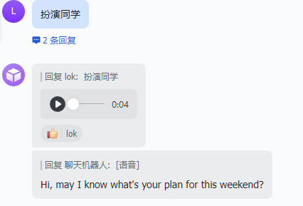

### 听力场景

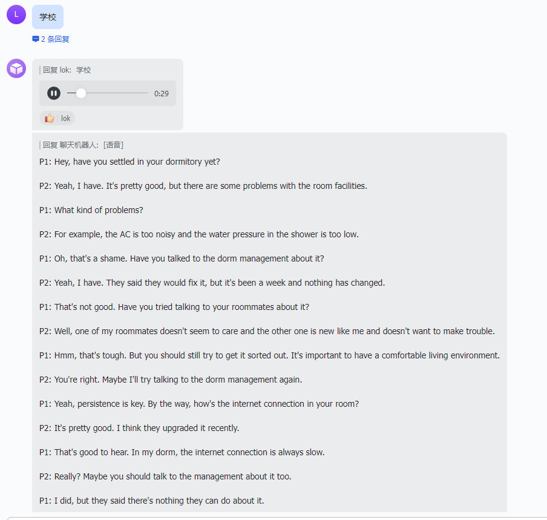


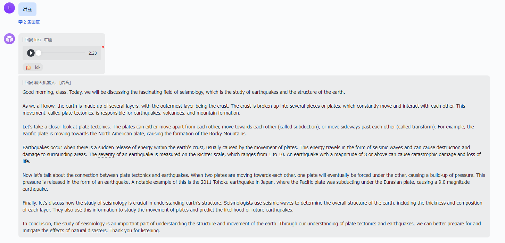

### 口语评分

> 使用Azure的口语评测功能，每个月有5个小时额度。

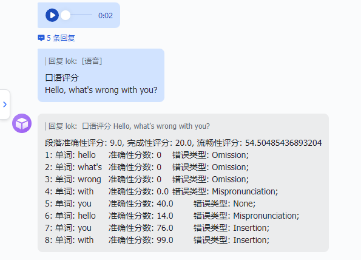


### 表情替代文字

回复表情含义

|      表情      |                             作用                             |
| :------------: | :----------------------------------------------------------: |
|    :heart:     | 对单词进行词根词缀分析<br /> |
|      :+1:      | 对回复的音频内容进行返回文本内容（**原文**）<br /> |
| :neutral_face: | 对阅读材料生成问题和选项<br /> |
|    :smile:     | 对阅读材料生成问题和选项，**输出答案**<br />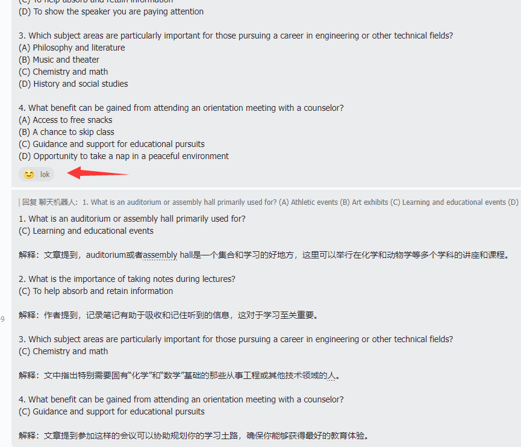 |
|     :pray:     | 语法批改<br />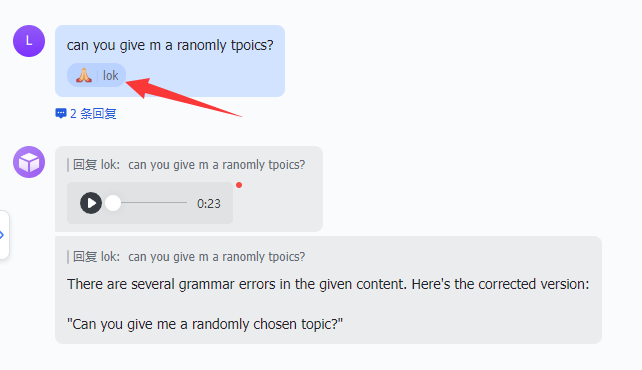<br />官方自带语法批改功能，不过**不支持语音语法批改**。<br />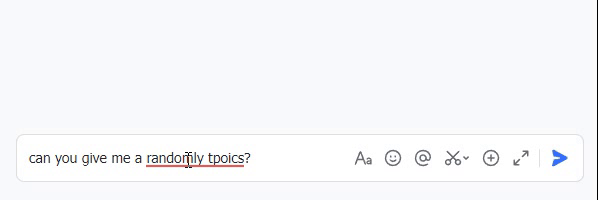 |
|    :muscle:    | 英文播放<br />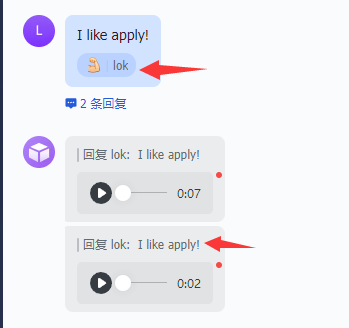 |
|                |                                                              |


## 安装

### 配置

#### 创建openai的key

访问：https://platform.openai.com/account/api-keys

点击`create new secret key`，就可以获取到key。


#### 飞书配置

访问[飞书开发者平台](https://open.feishu.cn/app?lang=zh-CN)创建**企业自建应用**。

获取**App ID**和**App Secret**。

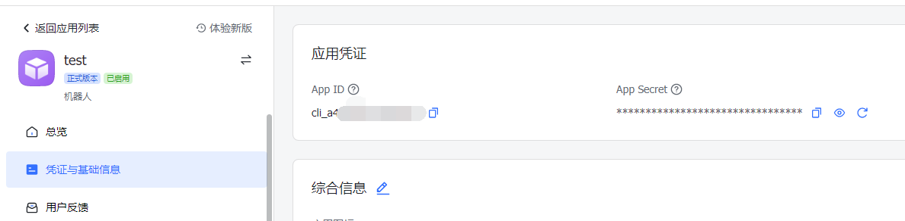

启动机器人

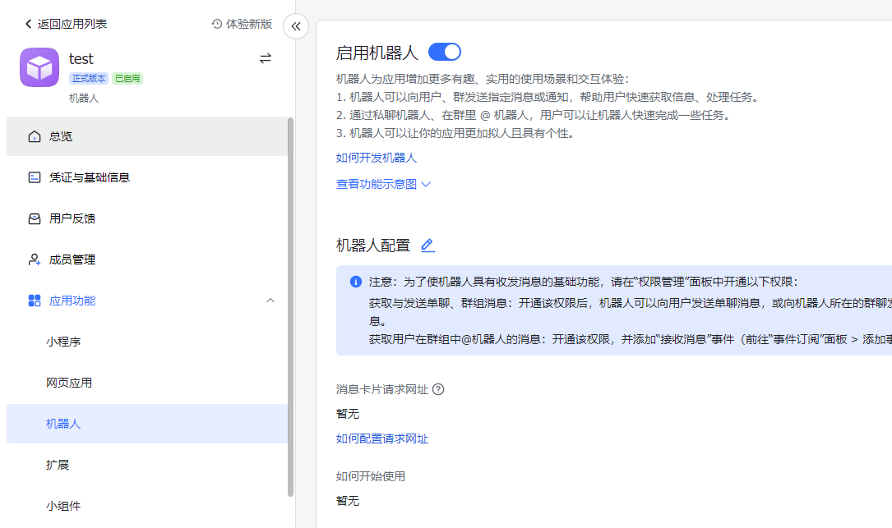


点击事件订阅，启动**事件订阅**，在**请求地址配置**：`https://ip/feishu/callback`。获取**Encrypt Key**和**Verification Token**

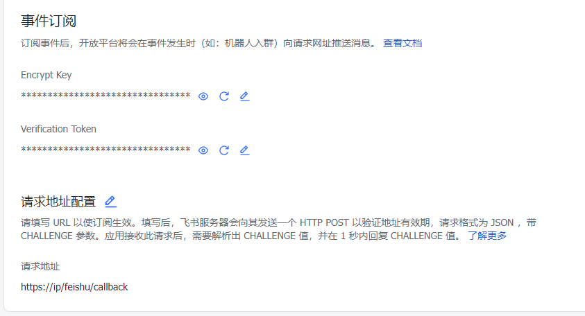

添加事件订阅，开通这些事件。**消息被reaction：**`im.message.reaction.created_v1`、**接收消息：**`im.message.receive_v1`

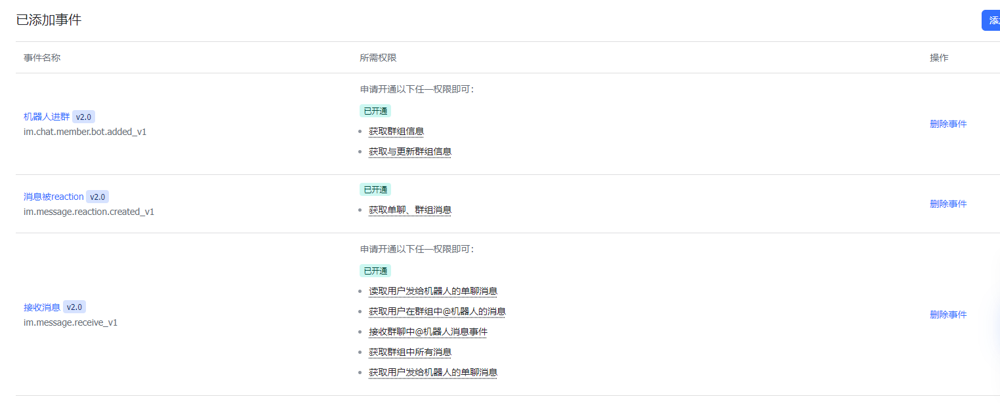

点击**权限管理**，批量开通消息权限：`im:message`、`file`、`drive:`、`chat:`、`im:resource`


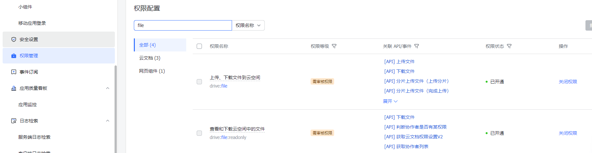

点击**版本管理与发布**进行发版应用，然后找管理员(自己)批准上线应用


#### 腾讯key

> https://cloud.tencent.com/document/product/1093/35686#.E5.85.8D.E8.B4.B9.E9.A2.9D.E5.BA.A6

> 腾讯语音识别文字功能每月有免费额度（每月5000次）

访问[腾讯ASR网站](https://console.cloud.tencent.com/asr)，开通ASR功能（主要是一句话识别）。

接着访问[API密钥管理](https://console.cloud.tencent.com/cam/capi)，创建一个密钥。


#### 微软key

> 需要信用卡，新注册信用卡可以免费使用1年微软语音服务。

> **如果没有这个，建议使用sougou或者youdao语音的引擎。**

访问[微软语音服务](https://portal.azure.com/#view/Microsoft_Azure_ProjectOxford/CognitiveServicesHub/~/SpeechServices)，创建订阅。

在**密钥和终结点**中获取密钥1和地区

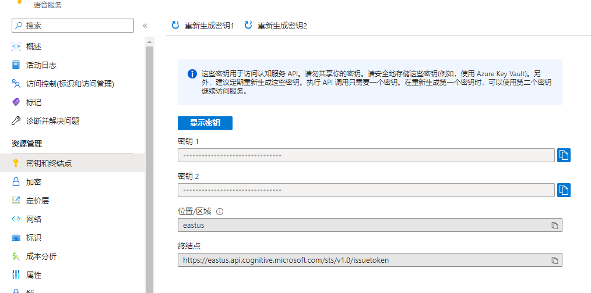


#### 配置文件

修改`core\config.py`文件，填上对应的密钥。

```
APP_ID = "" #飞书应用的App ID
APP_SECRET = "" # 飞书应用的App Secret
ENCRYPT_KEY = "" #飞书应用事件订阅的Encrypt Key
VERIFICATION_TOKEN = "" #飞书应用事件订阅的Verification Token
LARK_HOST = "https://open.feishu.cn"
TencentSecretId = "" #腾讯SecretId，用来语音转文字
TencentSecretKey = "" #腾讯SecretKey，用来语音转文字
AiKey = "sk-" #openai的key

azure_speech_key = ""  #微软的key
azure_service_region = "eastus" #微软资源的地区

text_and_audio = 0 #默认只回复英文语音，设置为1同时回复英语语音和英语文本。当配置为0的时候，可以采用官方的语音翻译功能对回复录音进行翻译，用于练听力。
random_word_num = 10 #随机抽取单词的个数
syntactic_correction = 0 #英语语法修正，默认不开启。修改为1代表开启语法批改。

audio_mode = "youdao"  #有三种语音模式，分别是：`youdao`、`sougou`、`azure`
sougou_speaker = 6 #搜狗语音有6种语音，可以选择自己喜欢的，参考https://fanyi.sogou.com/reventondc/synthesis?text=hello%20i%20am%20xiaoming&speaker=6
azure_speaker = "en-US-AriaNeural" #点击语音库，选择自己喜欢的声音。https://speech.microsoft.com/portal


```

> 可以不配置腾讯的key，**用飞书官方自带的语音转文字功能**。


### 本地部署

```bash
apt install -y ffmpeg
cd /opt 
git clone https://github.com/yingshang/feishu-talk
cd feishu-talk && pip3 install -r requirements.txt
python3 app.py
```

### docker部署
```bash
cd /opt 
git clone https://github.com/yingshang/feishu-talk
docker build -t feishu-talk .
docker run -itd -p 443:443 -v /opt/file:/opt/feishu-talk/file --restart=always feishu-talk
```


## todo

- [x] 语法批改

- [x] Azure SSML创建自定义音频

- [x] 话题模式


- [x] 余额查询
- [x] 帮助列表
- [x] 查询模式
- [x] 使用官方的语音识别（就可以不用同时发送语音和文字）
- [x] 词汇题生成


- [x] AI原文

- [x] 录入单词

- [x] 要背的单词随机抽取生成阅读文章（**需要上面录入单词**）

- [x] 英文句子播放

- [x] 表情替代文字功能

- [x] 单词分析（词根词缀助记）

- [x] 角色扮演

- [x] 听力场景生成

- [X] 听力阅读输出问题和选项

- [x] 口语评分（azure口语评测、腾讯智聆评测）

- [ ] 单词听力模式（返回音频，输入英文单词）

- [ ] 拼写模式（返回中文，输入英文）

- [ ] 添加语种(粤语、德语、法语等)


## 更新日志

- 2023.4.14：完成基本框架编写
- 2023.4.18：完成帮助列表、余额查询、清除会话状态、使用官方的语音识别、中文交流、英文句子播放、录入单词、词汇生成阅读、Azure SSML创建自定义音频
- 2023.4.20：修复azure语音转换不了文字。新增英语对话功能、语法批改、AI原文、听力场景生成功能。优化代码。
- 2023.4.21：新增表情替代文字功能
- 2023.4.24：新增听力阅读输出问题和选项功能
- 2023.4.27：删除一些没用功能。重写上下文对话逻辑。添加sqlite保存数据功能、添加更多表情场景（英语播放、语法批改、口语评测）。


## 联系方式

