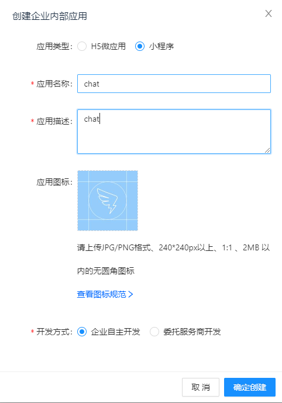
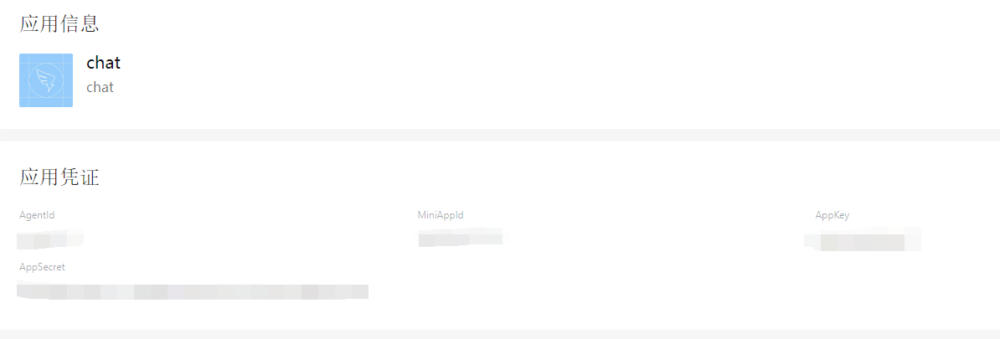
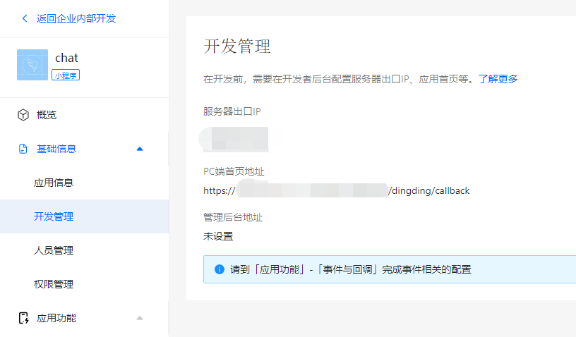
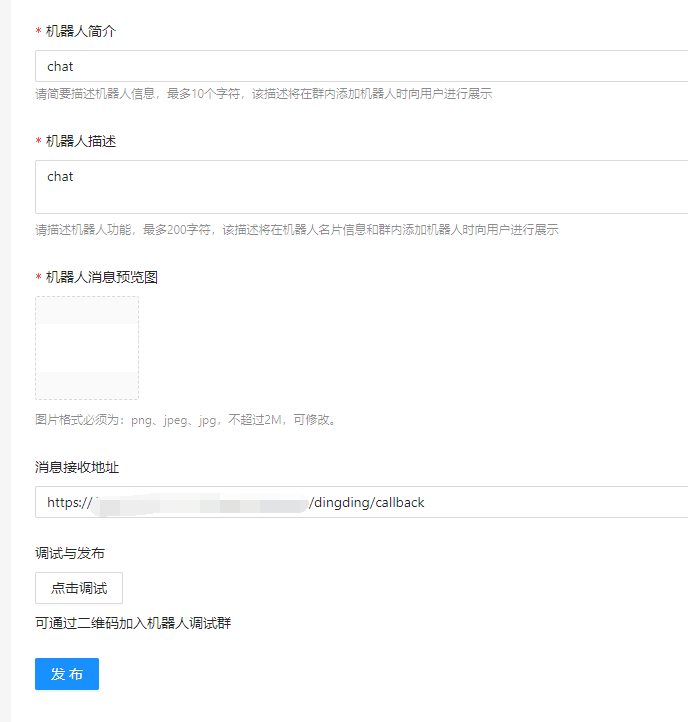
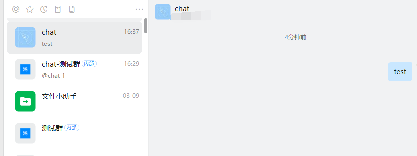

# 钉钉

## 配置
访问：https://open-dev.dingtalk.com/fe/app#/corp/app，点击**创建应用**，应用类型选择**小程序**,输入名字和描述。

在**应用凭证**提取**AppKey**和**AppSecret**

配置**出口IP**和**消息接收地址(`https://ip/dingding/callback`)**

在消息推送启动机器人，并且输入消息接收地址(`https://ip/dingding/callback`)，点击**发布**，再**点击调试**。

然后它会创建一个群，在群里面**点击机器人发送消息**，即可与机器人进行私聊。

