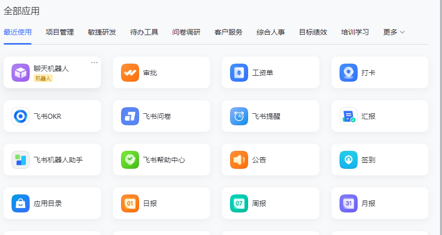
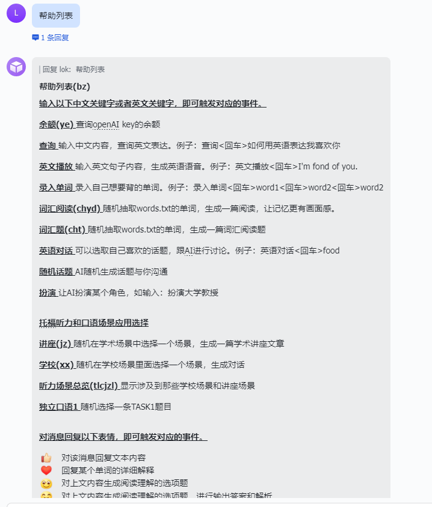
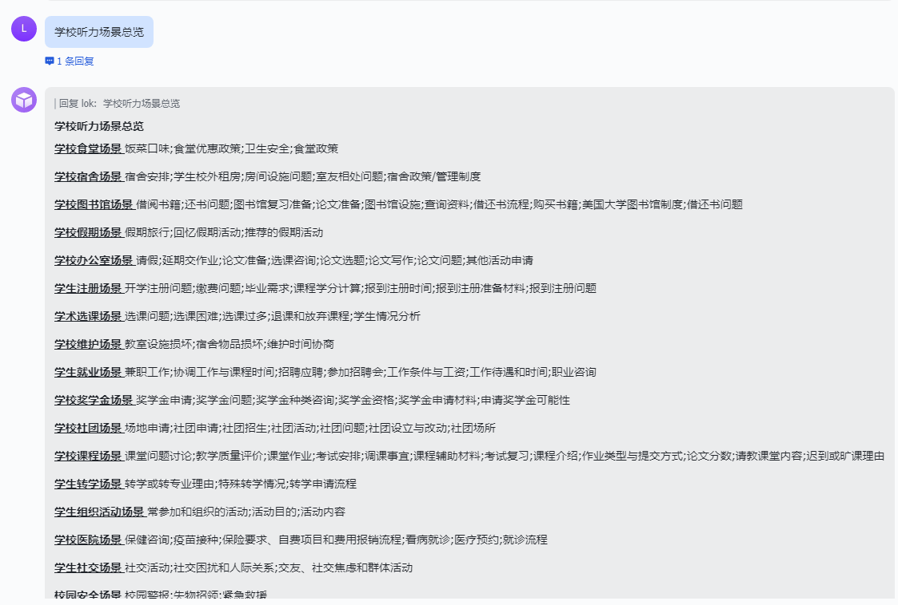
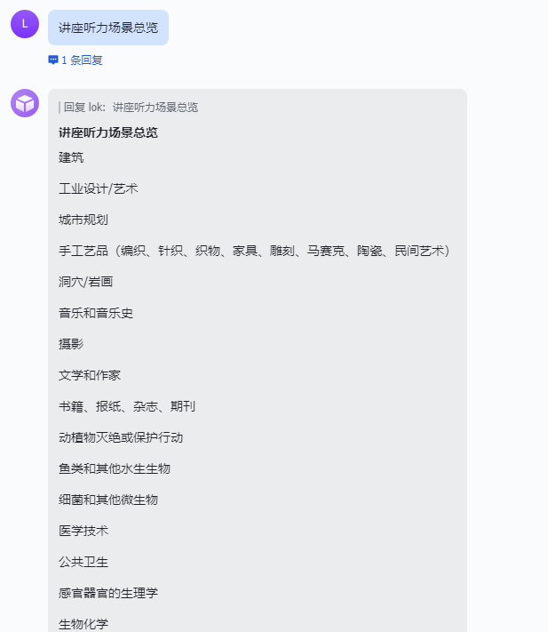
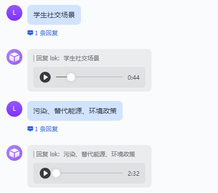
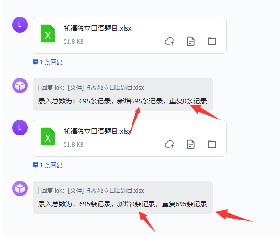
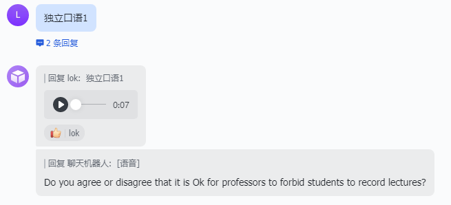
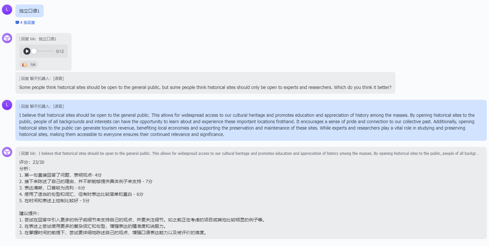
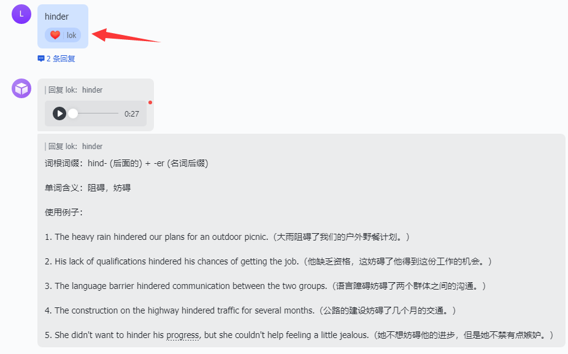

# 飞书

## 场景

首先介绍一下飞书的录音功能有三个模式：

- 录音功能，也就是录取用户说话的内容
- 语音识别功能，支持英文和普通话输入解析成文字。
- 语音+文字输入模式（文字用于标记语音，跟录音功能没有区别）**用这种模式可以不使用腾讯的ASR**

基于以上三种模式，我设想了以下几种场景：

1. 直接录音，获取飞书录音文件下载，让第三方厂商识别（微软、腾讯等）成文字，然后与openAI进行交互，获得结果，再以第三方厂商生成英文音频文件，最后飞书发回音频给我。 
2. 飞书直接将录音识别成文字，AI交互，生成音频，发送回来
3. 口语评分，对口语的录音进行评分
4. 口语的语法批改
5. 生成托福听力内容（包括学术场景、学校场景等）

## 演示

https://www.bilibili.com/video/BV1fV4y1d7Wv

## 飞书配置

访问[飞书开发者平台](https://open.feishu.cn/app?lang=zh-CN)创建**企业自建应用**。

获取**App ID**和**App Secret**。

启动机器人

点击事件订阅，启动**事件订阅**，在**请求地址配置**：`https://ip/feishu/callback`。获取**Encrypt Key**和**Verification Token**

添加事件订阅，开通这些事件。**消息被reaction：**`im.message.reaction.created_v1`、**接收消息：**`im.message.receive_v1`

点击**权限管理**，批量开通消息权限：`im:message`、`file`、`drive:`、`chat:`、`im:resource`

点击**版本管理与发布**进行发版应用，然后找管理员(自己)批准上线应用

最后在**工作台-**>全部应用找到聊天机器人。

## 功能

### 话题模式

### 余额查询

### 帮助列表

> **支持英文和中文缩写**

### 查询模式

### 官方语音识别

### 录入单词

### 词汇阅读

> 要**先录入单词**

### 角色扮演

### 托福听力场景

#### 学校场景

#### 讲座(学术)场景

#### 听力场景总览

查看可以用什么场景

指定听力场景

### 托福独立口语

#### task1

输入**托福独立口语模板**，飞书就会发送给你Excel模板。

下载完成之后，将口语题目加到Excel里面，修改Excel表名字为：`托福独立口语题目.xlsx`，再发送给飞书，系统就会录入题目。

随机选择一条记录，生成独立口语task1任务

对语音进行**文字（飞书语音转文字）或者语音回复**，即可获取评分。

#### task2

#### task3

#### task4

### 口语评分

> 使用Azure的口语评测功能，每个月有5个小时额度。

### 表情替代文字

回复表情含义

|      表情      |                             作用                             |
| :------------: | :----------------------------------------------------------: |
|    :heart:     | 对单词进行词根词缀分析  |
|      :+1:      | 对回复的音频内容进行返回文本内容（**原文**）  |
| :neutral_face: | 对阅读材料生成问题和选项  |
|    :smile:     | 对阅读材料生成问题和选项，**输出答案**  |
|     :pray:     | 语法批改  官方自带语法批改功能，不过**不支持语音语法批改**。  |
|    :muscle:    | 英文播放  |
|      :ok:      | 发送音频文件，用于后台播放（手机锁屏后会中断语音）  |

